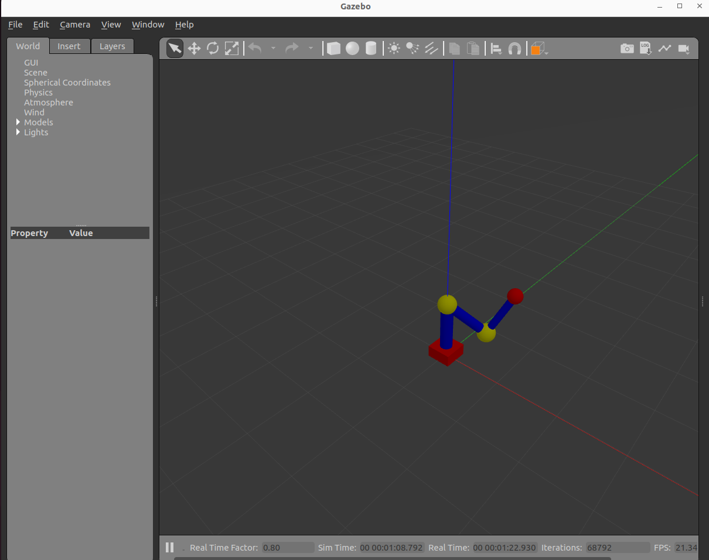
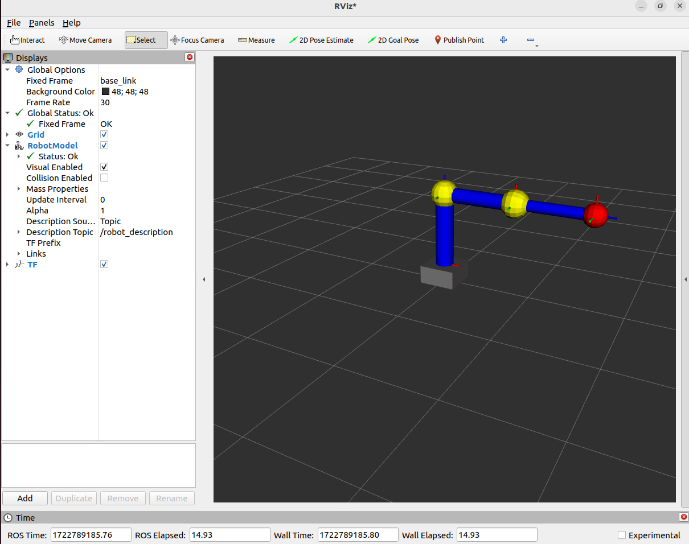

# ros2_3dof_arm

To use this project, create a folder `ros2_ws` and clone it as follows:
```
git clone https://github.com/yacin-hamdi/ros2_3dof_arm.git
```

## Visulaizing the Robot arm
To start the arm in gazebo and rviz, run the following command:
```
ros2 launch my_cobot_bringup cobot_gazebo.launch.xml 
```



## Robot simulation
To move the arm there are two script:
- [2dof_move_arm](https://github.com/yacin-hamdi/ros2_3dof_arm/blob/main/src/cobot_py/cobot_py/2dof_move_arm.py) is implementation of forward and inverse kinematics of two links and move the arm in rectangular form, the arm can move only in the x and y axis.
- [3dof_move_arm](https://github.com/yacin-hamdi/ros2_3dof_arm/blob/main/src/cobot_py/cobot_py/3dof_move_arm.py) is implementation of forward and inverse kinematics of the three links so we can move the arm in x, y and z axis.
